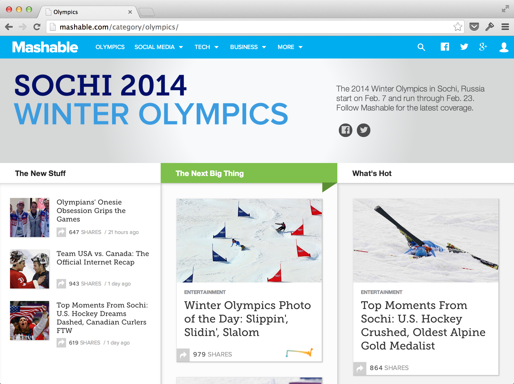
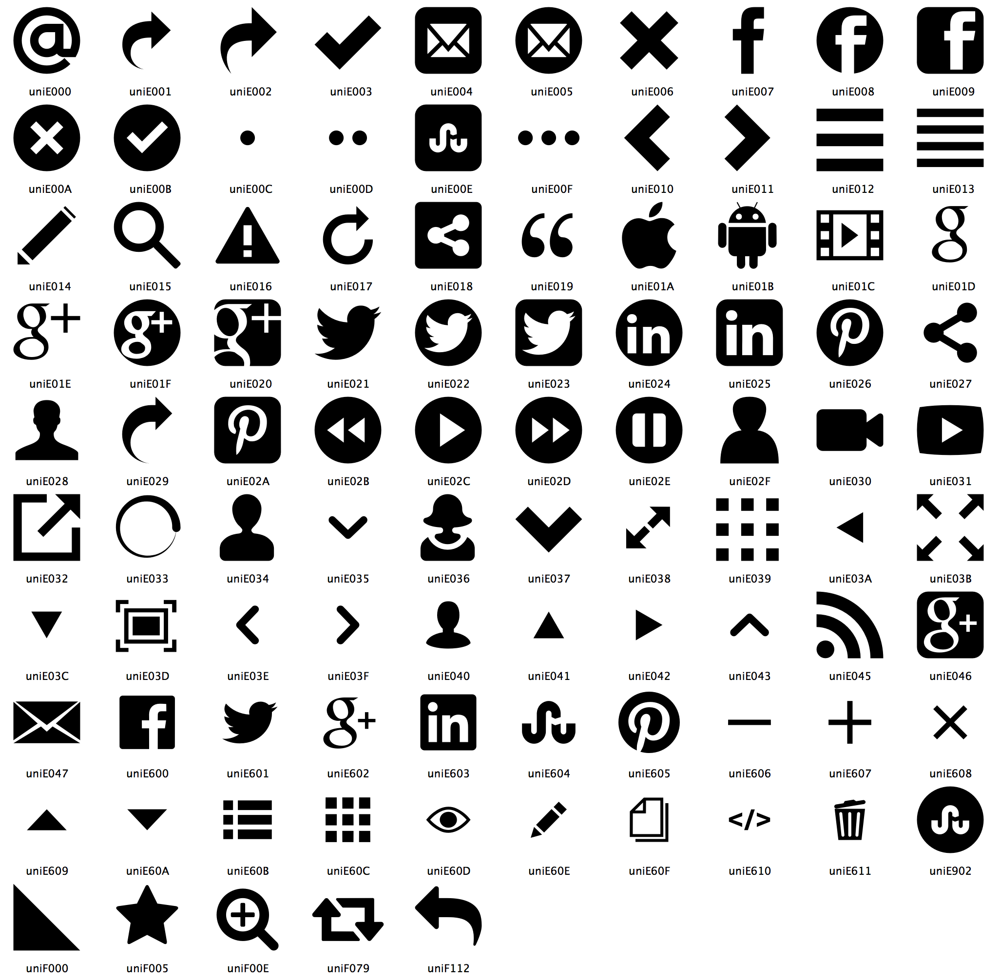
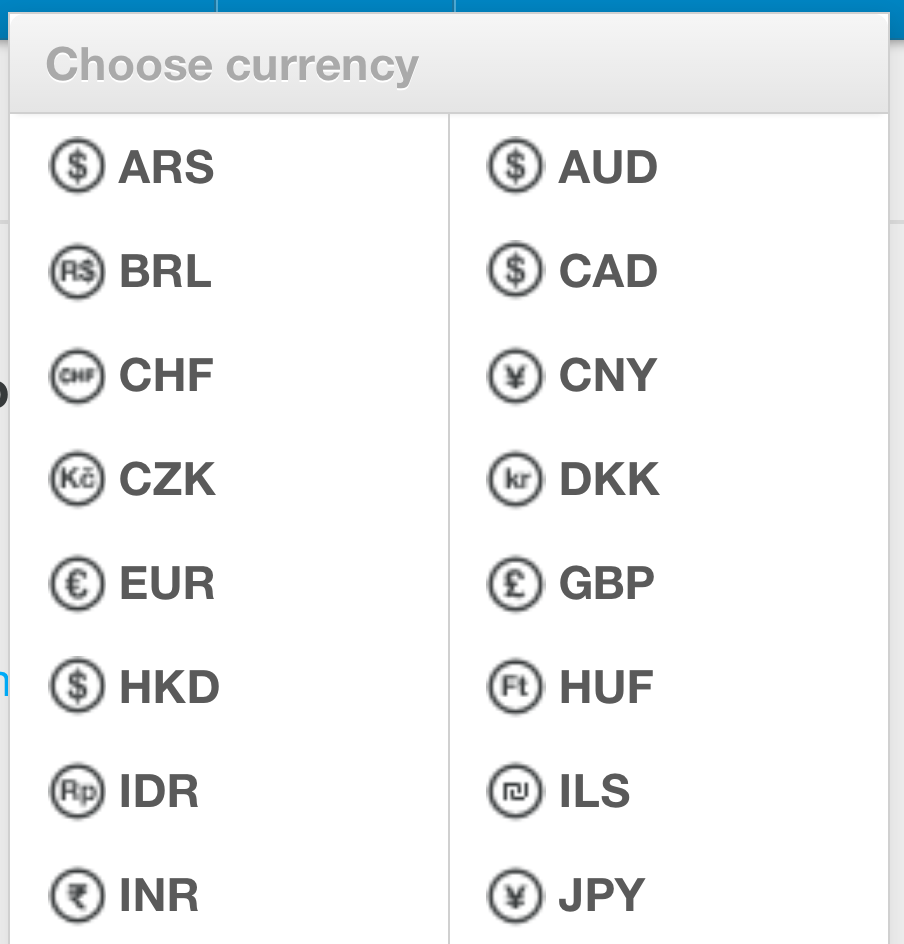
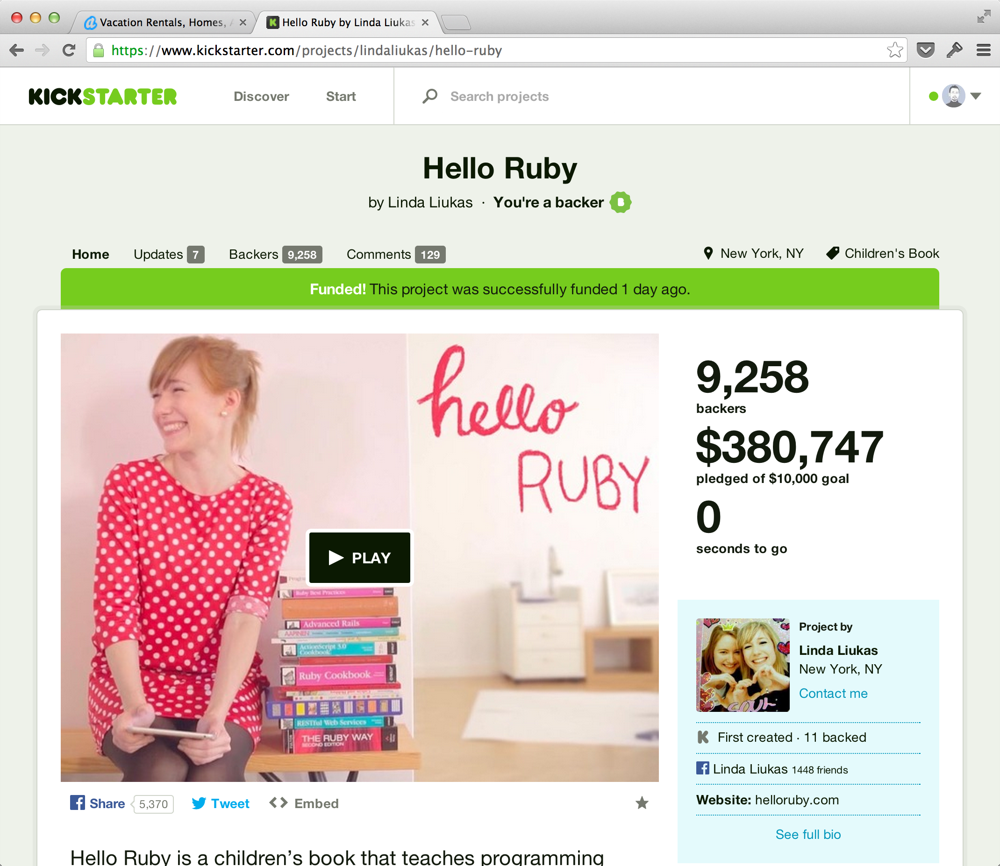
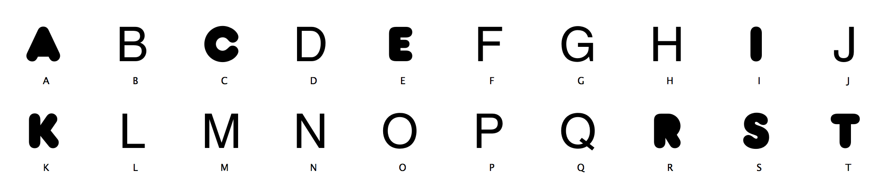
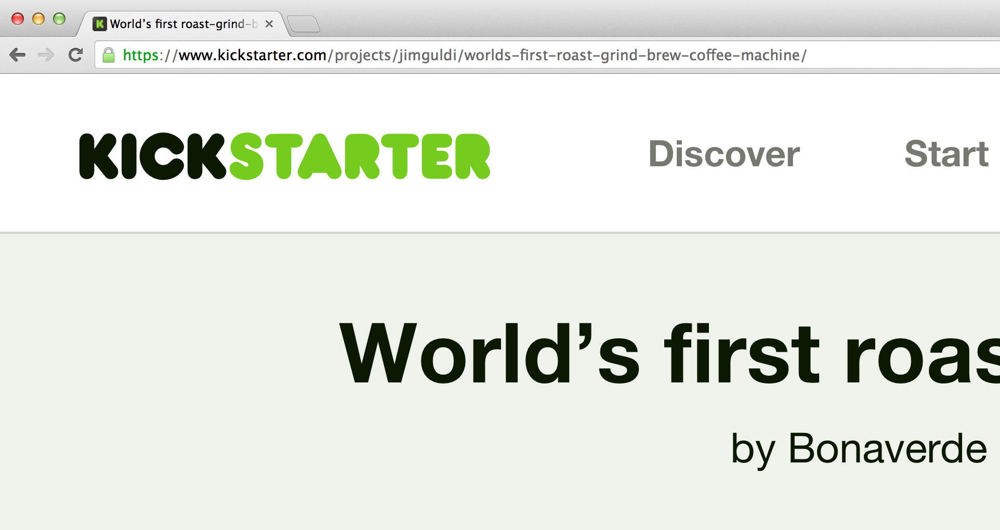
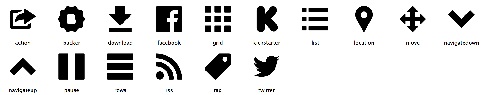
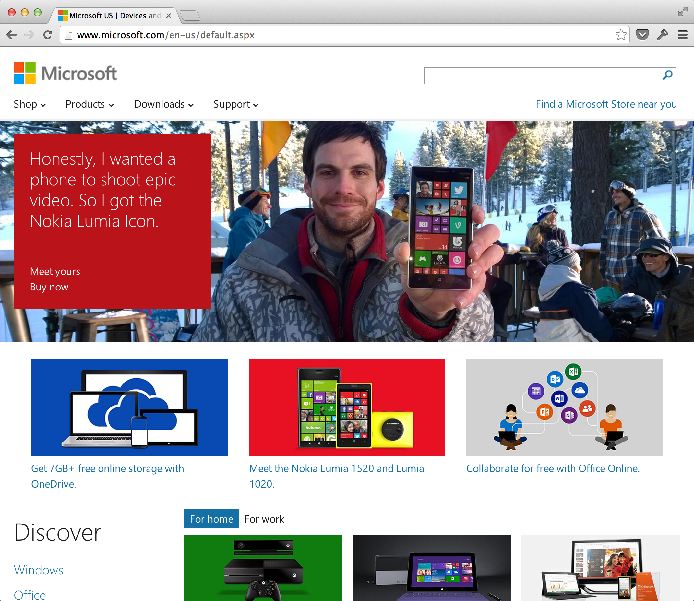
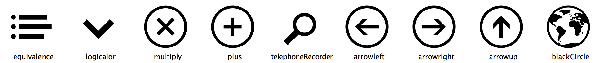

# Part 1: 使う

本書の前半では、シンボルフォントを「使う」ことを中心に取り上げます。シンボルフォントとはどんなものか、どのように探し、Webページに組み込めば良いのかを解説します。

# Chapter 1: シンボルフォントとは

シンボルフォント(symbol font)とは、字面の通り、「シンボル」が集められた「フォント」です。アイコンフォント(icon font)とも言います。

(TODO: シンボルフォントの説明を追加)

Webで使うようになる遥か前から、シンボルフォントは利用されてきましたが、その歴史を紐解くのは後にして、最新の利用事例を紹介することから始めましょう。

## Octicon

2012年5月、GitHubのリニューアルで、Octiconが導入されます。従来のサイトでは、アイコン部分をGIF画像として表示されていました。それらをすべて置き換えて、WebフォントにしたのがOcticonです。GitHubブログで”Designing the Visual Language”(視覚言語のデザイン)と、Octiconを紹介しています。

- [Say Hello to Octicons](https://github.com/blog/1106-say-hello-to-octicons) - *GitHub blog*

その制作の模様については、ブログの別記事に紹介があり、Photoshopを使ってデザインを進めて、Illustratorに取り込み、最終的にはGlyphsを使ってフォント化した模様などが明らかにされています。

- [The Making of Octicons](https://github.com/blog/1135-the-making-of-octicons) - *GitHub blog*

(TODO: スクリーンショット)

## 導入しているサイトの例

GitHubを筆頭として、シンボルフォントを導入しているサイトの例をいくつか挙げてみます。下記、テクノロジー系ベンチャーの印象が強いかもしれませんが、Microsoftが使い始めていることは、ひとつ特筆すべきことかもしれません。

- [GitHub](https://github.com/): Octicon (独自)
- [Mashable](http://mashable.com/): Mashicons (独自)
- [AirBnB](https://www.airbnb.com/): FontAwesome
- [KickStarter](https://www.kickstarter.com/) SSKickstarter (Symbolset.com)
- [Microsoft](http://microsoft.com): MSHP Icons (独自)

この中で、AirBnBは後述のオープンソースフォント「FontAwesome」をそのまま使っています。また、KickStarterも商用の「Symbolset」を使っています(※SSはSymbolsetの略)。その他は、独自フォントのようです。

### Mashable

100近いアイコンが登録されています。

### AirBnB

AirBnBはシンボルフォントを使っているものの、FontAwesomeにあるものだけを限定的に使うにとどまっています。独自アイコンの部分は従来のPNGファイルになっていて、画面を拡大するとアラが目立つのが残念な点です。フォント + PNG というこのダブルスタンダードは、本書の解決したい問題でもあるので、実装の中間点にある例として挙げました。

### KickStarter

Kickstarterのサイトでは、SSKickstarterというシンボルフォントが使われています。アルファベット部分を見ると、「K」「I」「C」「S」「T」「A」「E」「R」の8文字だけ太字になっているのに気づくでしょうか。この部分、実はロゴになっていて、ページ左上に鎮座しています。

上記太字の部分が、サイト内ではこのように表示されます。

アイコンも同じフォントに含まれていて、その種類は50種強です。(下記はその一部)

### Microsoft

トップページで使われていたフォントは非常に小規模なものですが、MicrosoftはWindows OSでシンボルフォントを積極的に使い始めています。その詳細については、Chapter 10「カラーフォント」の項で触れる予定です。

## オープンソースのシンボルフォント

### FontAwesome

- ライセンス: SIL Open Font License
- Webサイト: [http://fontawesome.io/](http://fontawesome.io/)

### Foundation Icon Fonts

- ライセンス: MIT License
- Webサイト: [http://zurb.com/playground/foundation-icon-fonts-3](http://zurb.com/playground/foundation-icon-fonts-3)

### Ligature Symbols

「くらげだらけ」のハンドルネームで活動しているKazuyuki Motoyama氏による作品。OFLで公開されています。

- ライセンス: SIL Open Font License
- Webサイト: [http://kudakurage.com/ligature_symbols/](http://kudakurage.com/ligature_symbols/)

### ionicons

- ライセンス: MIT License
- Webサイト: [http://ionicons.com/](http://ionicons.com/)

## 有償のシンボルフォントサービス

### IcoMoon

- Webサイト: [http://icomoon.io/](http://icomoon.io/)

### GLYPHICONS

- Webサイト: [http://glyphicons.com/](http://glyphicons.com/)

### Symbolset

- Webサイト: [https://symbolset.com/](https://symbolset.com/)

## Webdingsからの小歴史

## フラットデザイン

## 文字化するアイコン

誤解を恐れずに言うならば、アイコン(シンボル)は、「漢字」に近いものです。

- **表音文字** : アルファベット、かな、ハングルなど
- **表意文字** : 数字、漢字、絵文字、アイコン

1文字ごとに意味を持たないアルファベットと違い、漢字は一目見て意味を理解できることがあります。ただ、象形文字から現在の漢字に変化する中で変化してしまい、元の形が理解できないものが多いため、必ずしも「表意」しているとも言い切れません。そのため、漢字はより正しくは「表語文字」と分類されます。

TODO: 漢字、絵文字のイラスト

それに対して、絵文字はもっと分かりやすく意味を「表意」しています。日本の携帯文化の中で絵文字が流行し、その後、Unicode策定の際に絵文字が取り込まれましたが、そのニュースは、当時驚きを持って伝えられました。この動きの中で、積極的な働きかけを行ったのがGoogleだったことも興味深い点です。

アイコンも、デフォルメされ習慣と結びつき、かつて文字が辿った道を歩んでいます。電源アイコンや、一時停止アイコンなど、抽象的なものでさえ、ユーザはその意味を暗黙に理解しているのは、改めて考えると不思議な話かもしれません。アイコンの大きな特徴として、言語と独立していることが挙げられます。Webサイトでは、日本語でも、英語でも、基本的には同じアイコンが使われます。つまり、日本語圏だろうと英語圏だろうと、「電源」アイコンは、「電源」として認識されるのです。

TODO: 電源のアイコンのイラスト

シンボルフォントはひとつのWebサービスやアプリケーションにとっての文字体系になりつつあります。構成要素が非常に流動的で、対応する特定の言語を持たないため、これを文字と認めるかどうかは立場が分かれるでしょう。ただ技術的な要請だけでフォントになったという以上のものが、シンボルフォントにはあるように思うのです。

Webアプリケーションや、iPhoneアプリケーションの中で、統一したアイコンデザインを使うことは、UX(ユーザ体験)の観点から重要です。アプリケーション特有の概念をアイコン化することで、意味の体系が立ち上がってきます。ユーザに対し、アプリケーションのセマンティクスをうまく伝えることができるか、これはUI/UXの要でもあります。

