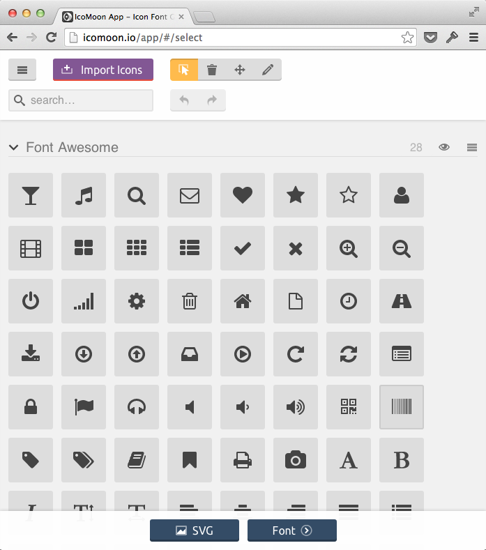

# Part 1: 使う

本書の前半では、シンボルフォントを「使う」ことを中心に取り上げます。シンボルフォントとはどんなものか、どのように探し、Webページに組み込めば良いのかを解説します。

# Chapter 1: シンボルフォントとは

シンボルフォント(symbol font)とは、字面の通り、「シンボル」が集められた「フォント」です。アイコンフォント(icon font)とも言います。

(TODO: シンボルフォントの説明を追加)

Webで使うようになる遥か前から、シンボルフォントは利用されてきましたが、その歴史を紐解くのは後にして、最新の利用事例を紹介することから始めましょう。

## Octicon

2012年5月、GitHubのリニューアルで、Octiconが導入されます。従来のサイトでは、アイコン部分をGIF画像として表示されていました。それらをすべて置き換えて、WebフォントにしたのがOcticonです。GitHubブログで”Designing the Visual Language”(視覚言語のデザイン)と、Octiconを紹介しています。

- [Say Hello to Octicons](https://github.com/blog/1106-say-hello-to-octicons) - *GitHub blog*

その制作の模様については、ブログの別記事に紹介があり、Photoshopを使ってデザインを進めて、Illustratorに取り込み、最終的にはGlyphsを使ってフォント化した模様などが明らかにされています。

- [The Making of Octicons](https://github.com/blog/1135-the-making-of-octicons) - *GitHub blog*

(TODO: スクリーンショット)

## 導入しているサイトの例

GitHubを筆頭として、シンボルフォントを導入しているサイトの例をいくつか挙げてみます。下記、テクノロジー系ベンチャーの印象が強いかもしれませんが、Microsoftが使い始めていることは、ひとつ特筆すべきことかもしれません。

- [GitHub](https://github.com/): Octicon (独自)
- [Mashable](http://mashable.com/): Mashicons (独自)
- [AirBnB](https://www.airbnb.com/): ~~FontAwesome~~ AirGlyphs (独自)
- [KickStarter](https://www.kickstarter.com/) SSKickstarter (Symbolset.com)
- [NIKE](http://www.nike.com/): OneNikeGlyphs (独自)
- [Microsoft](http://microsoft.com): MSHP Icons (独自)

この中で、AirBnBは後述のオープンソースフォント「FontAwesome」をそのまま使っています。また、KickStarterも商用の「Symbolset」を使っています(※SSはSymbolsetの略)。その他は、独自フォントのようです。

### Mashable

100近いアイコンが登録されています。

### AirBnB

AirBnBはシンボルフォントを使っているものの、FontAwesomeにあるものだけを限定的に使うにとどまっています。独自アイコンの部分は従来のPNGファイルになっていて、画面を拡大するとアラが目立つのが残念な点です。フォント + PNG というこのダブルスタンダードは、本書の解決したい問題でもあるので、実装の中間点にある例として挙げました。

#### AirBnB 追記 (2014年3月)

上記を書いた後、AirBnBのサイトでシンボルフォントに関する変更がありました。FontAwesomeの代わりに、独自フォントのAirglyphsを導入し、独自フォント路線に切り替えています。上記の通貨アイコンも、シンボルフォントに置き換わって、表示が洗練されました。

まだ、フォントに登録されていても、実際にサイトで使われていないグリフもありそうなので、今後、WEBサイトの中で利用範囲を広げていくと思われます。

### KickStarter

Kickstarterのサイトでは、SSKickstarterというシンボルフォントが使われています。アルファベット部分を見ると、「K」「I」「C」「S」「T」「A」「E」「R」の8文字だけ太字になっているのに気づくでしょうか。この部分、実はロゴになっていて、ページ左上に鎮座しています。

上記太字の部分が、サイト内ではこのように表示されます。

アイコンも同じフォントに含まれていて、その種類は50種強です。(下記はその一部)

### NIKE

[NIKE](http://www.nike.com/)

一般的な矢印などのアイコンに加えて、NIKEの各ブランドのロゴや、製品を模したアイコンなどが含まれます。ロゴにカーソルを合わせた際の色変更をCSSで表現するなど、シンボルフォントをうまく使っています。

### Microsoft

トップページで使われていたフォントは非常に小規模なものですが、MicrosoftはWindows OSでシンボルフォントを積極的に使い始めています。その詳細については、Chapter 10「カラーフォント」の項で触れる予定です。

## オープンソースのシンボルフォント

シンボルフォントの利用が進む中で、オープンソースのシンボルフォントにも人気が集まっています。その中から、汎用的に利用できるフォントを4つほど紹介しましょう。これ以外にも、「Chapter 10: デザインのアイデア」にいくつか面白いフォントの例を載せていますので、そちらも参考にしてください。あわせて、「Appendix-D: 関連URL一覧」の項もどうぞ。

### FontAwesome

収録アイコンの非常に多い、オープンソースのシンボルフォントの代表格です。シンプルでオーソドックスなアイコンデザインです。基本サイズが14pxと、比較的小さなサイズでの表示を想定して作られていて、メニューの文字の横などに置くのに適しています。最近のフラットデザインで使われるアイコンより、線が太めなので、大きいサイズで使う場合はテイストに注意した方が良いかもしれません。

- 収録数: 369アイコン
- ライセンス: SIL Open Font License
- Webサイト: [http://fontawesome.io/](http://fontawesome.io/)

### Foundation Icon Fonts

Foundationは、SassベースのCSSフレームワークとして人気の高いもののひとつですが、シンボルフォントも提供しています。FontAwesomより若干大きめの16pxを基本サイズとしています。このアイコンのテイストもベーシックなものですが、FontAwesomeよりも直線的なデザインになっています。

- 収録数: 283アイコン
- ライセンス: MIT License
- Webサイト: [http://zurb.com/playground/foundation-icon-fonts-3](http://zurb.com/playground/foundation-icon-fonts-3)

### Ligature Symbols

「くらげだらけ」のハンドルネームで活動しているKazuyuki Motoyama氏による作品。OFLで公開されています。Symbolsetにインスパイアされて作成されており、まだ数の少ないリガチャを使ったオープンソースフォントのひとつです。

- ライセンス: SIL Open Font License
- Webサイト: [http://kudakurage.com/ligature_symbols/](http://kudakurage.com/ligature_symbols/)

### ionicons

細い線のフラットデザイン向きのフォントを多く揃えています。モバイル向けのUIフレームワーク「[Ionic](http://ionicframework.com/)」の一部として提供されています。1つのフォント内に、

- 共通アイコン
- iOS7の標準アイコン
- Androidの標準アイコン
- ソーシャルアイコン

の4パートがあり、それぞれテイストが異なります。PhoneGapなどのWeb/Appのハイブリット制作に特化しているのが特徴ですが、Webのみの用途にも使えるシーンは多いでしょう。共通アイコンの基本サイズは、16pxです。

- ライセンス: MIT License
- Webサイト: [http://ionicons.com/](http://ionicons.com/)

### Dashicons

WordPress 3.8 以降で管理画面用に導入されたシンボルフォントです。WordPressに合わせて、DashiconのライセンスもGPLv2となっているのが特徴です。

- ライセンス: GPLv2
- Webサイト: [http://melchoyce.github.io/dashicons/](http://melchoyce.github.io/dashicons/)

## 有償のシンボルフォントサービス

アイコンのストックサービスは、10年ほど前から存在していましたが、その一部がシンボルフォントの提供を始めています(GLIPHICONSほか)。あるいは、Webフォントに特化する形でサービスも出てきました(Symbolset)。ロイヤリティフリー、クオリティが高い、テイストの選択肢があるなど、サービス毎の特徴があります。ここでは、3つほどを紹介します。

下記以外についても、参考までいくつかを「Appendix-D: 関連URL一覧」の項にリストアップしておきます。

### IcoMoon

[IcoMoon](http://icomoon.io/)は、多数のシンボルフォントを揃え、目的に合わせて自由に組み合わせたフォントを作成・ダウンロードできるWEBサービスです。IcoMoonを使ったシンボルフォント作成については、「Chapter-7: フォントの作り方 - Illustrator 編」でも詳しく紹介します。

Free Planでも、フォントの作成については自由に行えるので、自分のサイトに手動で組み込む分には十分です。ただし、更新の際には再度手動で組み込み直しが必要になるため、本格的な利用には有料プランが使いやすいでしょう。Unlimited Planでは、IcoMoonのサーバ上でフォントファイルをホスティングしてくれるため、いちいちダウンロードして組み込む必要がありません。指定されたCSSをHTMLに組み込むだけで、使い始めることが出来ます。

なお、作業フローの自動化は、他の手段でもできますが、その場合コマンドラインからの操作がどうしても一部必要になります。「黒い画面を使いたくない!」というデザイナにとっては、こちらが唯一の選択になるかもしれません。

IcoMoonのWebアプリケーションは、このような画面になっています。必要なグリフを選択するだけで、あるいは独自のグリフを登録するだけで、簡単にWebフォントに書き出してくれます。

- Webサイト: [http://icomoon.io/](http://icomoon.io/)

### GLYPHICONS

GLYPHICONSは、Bootstrapの標準シンボルフォントとして取り込まれたことでも有名です。その以前からもモバイルアプリ向けを中心にアイコンを提供していて、オープンソースライセンス化された「HALFLING」以外にも、PRO版では500近いアイコンを揃えています。

他のフォントサービスとの違いは、有償版について、ロイヤリティフリーのライセンス体系を取っていることです。後述のSymbolsetはフォントの改変を認めていませんし、FontAwesomeなどのオープンソースフォントも、改変後のフォントを同一ライセンスで公開することが(ほとんどの場合)義務づけられています。その点、企業サイトなどでの導入を考えると、GLYPHICONSは非常に利用しやすいライセンスです。

- GLYPHICONSをそのまま使う
- GLYPHICONSの一部のグリフを改変して使う
- GLYPHICONSに独自のグリフを追加して使う

上記のいずれの方法でも使うことが出来ます。(有償版のみ)

- ライセンス: 独自 (ロイヤリティフリー)
- Webサイト: [http://glyphicons.com/](http://glyphicons.com/)

### Symbolset

Symbolsetは、リガチャを活用したシンボルフォントを提供する、非常にユニークなサービスです。今でこそ、リガチャをシンボルフォントに使う方法は大分知られてきましたが、Symbolsetのサービスが発表されたときは非常に衝撃的でした。[Symbolsetのブログ](http://blog.symbolset.com/archive)には、リガチャやシンボルフォントについての技術的な記事も掲載されていて参考になります。

リガチャの利用については、本書のChapter-4, 5でも取り扱います。

- ライセンス: 独自 (改変不可・サブセットも不可)
- Webサイト: [https://symbolset.com/](https://symbolset.com/)

## Dingbatsからの小歴史

印刷の時代から、文字装飾のために[Dingbat](http://en.wikipedia.org/wiki/Dingbat)が使われてきました。最近はあまりDingbatという言い方をしないようですが、基本的には「Dingbat(s) = シンボルフォント」です。Dingbatsから始まって、日本の絵文字を経て、フラットデザインの潮流の中、どのようにシンボルフォントが再認識されるのか、そのアウトラインを追います。

### Zapf Dingbats

Hermann Zapfが70年代中頃に制作した1,000近いdingbatのうち、360あまりが選ばれて[Zapf Dingbats](http://www.fonts.com/font/itc/itc-zapf-dingbats)フォントとして1978年にリリースされます。この時点では、印刷を主目的としていて、Apple社のプリンタ「LaserWriter」シリーズなどにも搭載されていました。

コンピュータで使われるようになった当初は、アルファベットや数字のコードに割り振られていましたが、その後、1993年にはUnicodeに取り入れられ、独立したコードが振られるようになります(U+2700からU+27BF)。

### エモーティコン (顔文字)

単独の文字という意味では、本流を離れるのですが、エモーティコンについて言及しておく必要があるでしょう。電子メールが普及し始めて間もなく、「:-)」などの西洋式(western style)の顔文字が使われ始めます。諸説あるようですが、カーネギーメロン大のScott Fahlman氏が最初にエモーティコンに言及したと言われています (1982年)。エモーティコンは、その後2つの方向で発展を遂げます。

- Web上の掲示板システム上で使われるアイコン画像
- 日本で使われる顔文字「(^_^)」 (Japanese style)

どちらも「文字」ではなかったものの、ユーザにとって感情表現の一般的な手段となって行きます。前者は、掲示板だけでなく、多くのメッセージアプリケーションで使われ、最近ではLINEの「スタンプ」に行き着きます。同様の機能をFacebookも実装したことで、画像によるコミュニケーションのニーズが示されているように思います。後者については、パソコン通信時代に日本で独自の発展を遂げていきます。

### Webdings

Microsoftからリリースされた[Webdings](http://www.fonts.com/font/microsoft-corporation/webdings)フォントは、当時、急速に普及し始めたWebへのニーズを満たすために作られました(1997年)。メールアイコンやWebを表す地球儀アイコンが導入されているのが特徴的です。また、今となっては時代を感じさせるものになっていますが、携帯電話やフロッピーディスクなどのデバイスのアイコンも多く含まれていました。ただし、この時点でも、フォントが使われるシーンはWebページの中ではなく、マニュアルなどの印刷媒体でした。

### 機種依存文字

コンピュータ文書で記号(外字)が用いられるようになって来ると、問題になったのが環境による表示の不統一でした。日本では、MacとWindowsともに文字コードとしてShiftJISが使われて来ましたが、同じコードにも関わらず外字に関してフォントとコードのマッピングが異なるため、環境によって文字が変わってしまうという事態がしばしばおきていました。

- 例: 丸囲みの1 (Windows・MSゴシック) → 括弧囲みの曜日 (Mac・Osakaフォント)

Dingbatsは、外字の問題以前に、フォントによって表示される文字がまったく異なるため、「機種依存」と考えられていました。そのため、インターネットのコミュニケーションでは「使えない」、これが共通認識となっていきます。

### 携帯電話の絵文字

当時、新たなDingbats「絵文字」が日本の携帯電話に出現していました (iモードは1999年から)。各携帯キャリア毎に絵文字の規格が決められ、少なくとも、DoCoMo同士、Softbank同士(当時はJ-PHONE)などであれば電話機そのものの機種を問わず「絵文字」を利用できます。顔文字だけでは表現しにくい絵柄も、絵文字があれば小さな携帯端末の画面内でも伝えることができました。

各キャリアのネットワークがインターネットに接続され、キャリア間や電子メールとの通信が始まると、絵文字の文字化けが問題になります。その後、キャリア間の通信については、各社の間で変換が施され、100%ではないもののある程度の互換性を持つようになります(2005年以降)。ただし、電子メールについては、Unicodeの普及まで絵文字から取り残されていました。

### Unicode

絵文字については、キャリア毎に「外字」として独自の文字コードが使われていたため、インターネットで流通されるには問題を抱えていました。そこに、助け舟を出したのは国内企業ではなく、Google社とApple社でした。2008年に[emoji4unicode](https://sites.google.com/site/unicodesymbols/Home/emoji-symbols)プロジェクトが開始され、その成果の一部が[Unicode 6.0.0](http://www.unicode.org/versions/Unicode6.0.0/)に収録されるに至ります (2010年)。

現在では、携帯電話やiPhoneに加えて、Mac OS XやWindows 8などにも絵文字が搭載されています。そのため、技術的にはPC向けのWebページでも表示することが可能ですが、あまりそういった例はありません。利用は携帯向けのサイトに限られています。

表現を求めて外字を拡張し、Unicodeに取り込まれるという歴史が繰り返されてきました。次期バージョンであるUnicode 7.0でも、多くの絵文字(ピクトグラム)が取り込まれる模様です。

- Zapf Dingbats → Unicode 1.1.0
- Emoji → Unicode 6.0.0
- Webdings, Wingdings → Unicode 7.0 (予定)

### Webフォント

ここまでが、文字の拡張と統一の歴史だったとすると、少し毛色の違う動きが2000年前後に始まります。文字コードを統一する必要があったのは、異なる環境でも正しく文書を見られるようにするためでした。でも、もし環境ごと(少なくともフォント環境ごと)ドキュメントを移動できたら? そうすれば必ずコードと文字は一対一対応するため、文字化けの心配はもうありません。タイポグラフィーによるデザイン表現をあきらめる必要ももうありません。これを実現するのが、Webフォントです。詳細は次章にゆずりますが、TrueTypeやOpenTypeをWebで使うために調整したEOTやWOFFといったフォーマット、それからSVGの一部として定義されたSVGフォントなどがあります。

Webフォントは、元々印刷向けに作られてきたフォントを、ライセンス問題などをクリアにしてWebで使いやすいようにしたものです。それまで、ユーザ環境にインストールされたフォントしか使えなかったのが、Webフォントを導入すればありとあらゆるタイポグラフィーの表現が可能になります。

シンボルフォントとWebフォントの相性の良さが認識されるのは、実はごく最近、ここ数年の話です。次節では、Webで起きている最近の潮流について見ていきましょう。

## 最近のWebデザインのトレンド

従来であれば、アイコンを少ないドットで表現するために、色数を使わなければならなかったものが、解像度の増加とともに単色でも十分な表現力を持つようになりました。また、iPhoneやiPad、Android端末に、従来のPC、Retina解像度のMacBook Proなど、あらゆる解像度と画面サイズのバリエーションが現れます。

- 端末の解像度の増加
- 端末の画面サイズのバリエーションの増加
- 写真・動画がコンテンツの主体に

そんな中、アイコンを美しく表示する方法として、Dingbatsつまりシンボルフォントの良さが再認識されています。

### レスポンシブWebデザイン

異なる画面サイズのデバイスでも、正しくWebサイトのコンテンツが表示できるWebデザインが求められるようになりました。デバイスの種類が増えていることもそうですが、表示環境に大きく依存するWebのデザインを紙面デザインの延長でやることに限界が来ていた、というのが実際かもしれません。

スマートフォンユーザの増加とともに、「モバイルファースト」が叫ばれるようになり、PC画面での表示よりもむしろモバイル対応を先にやるというのが当たり前になっています。解像度の異なるデバイスで、美しく表示するには、従来の方法だと

- 通常解像度の画像 @1x
- Retina解像度の画像 @2x

あるいは、さらに他の解像度の画像を用意する必要があり、制作工程での負担になっていました。その点、フォントであればベクターデータなので拡大縮小がいくらでも出来ます。

### フラットデザイン

レスポンシブWebデザインと平行して、進んで来たのが、フラット化の流れです。この背景には、画面解像度の大きな改善があります。iPadやKindle Fireの最新機種の解像度は300dpiを超え、とうとう一般的なレーザープリンタの解像度を超えてしまいました。つまり、紙の雑誌のような、タイポグラフィーを多用したクリスプな画面構成がWebでも可能になったのです。そうすると、むしろこてこてした修飾は不要となり、シンプルな画面構成が成立します。

iPhoneやMac OSで採用された、写実的なアイコンの流行が一段落したこともあり、デザインはよりシンプルな方向へ向かっています。これは、レスポンシブWebデザインからの要請にも合致していました。多数のデバイスでデザインの整合性を取るには、元々のデザインがシンプルであることが望ましかったからです。「アイコンは単色が望ましい」ということであれば、これはもうフォントの出番です。

かくして、30年あまりの時を経て、Dingbatsはシンボルフォントに行き着き、デザイン上の大きな自由度を獲得するに至りました。

## 文字化するアイコン

誤解を恐れずに言うならば、アイコン(シンボル)は、「漢字」に近いものです。

- **表音文字** : アルファベット、かな、ハングルなど
- **表意文字** : 数字、漢字、絵文字、アイコン

1文字ごとに意味を持たないアルファベットと違い、漢字は一目見て意味を理解できることがあります。ただ、象形文字から現在の漢字に変化する中で変化してしまい、元の形が理解できないものが多いため、必ずしも「表意」しているとも言い切れません。そのため、漢字はより正しくは「表語文字」と分類されます。

TODO: 漢字、絵文字のイラスト

それに対して、絵文字はもっと分かりやすく意味を「表意」しています。日本の携帯文化の中で絵文字が流行し、その後、Unicode策定の際に絵文字が取り込まれましたが、そのニュースは、当時驚きを持って伝えられました。この動きの中で、積極的な働きかけを行ったのがGoogleだったことも興味深い点です。

アイコンも、デフォルメされ習慣と結びつき、かつて文字が辿った道を歩んでいます。電源アイコンや、一時停止アイコンなど、抽象的なものでさえ、ユーザはその意味を暗黙に理解しているのは、改めて考えると不思議な話です。また、アイコンの大きな特徴として、言語と独立していることが挙げられます。Webサイトでは、日本語でも、英語でも、基本的には同じアイコンが使われます。つまり、日本語圏だろうと英語圏だろうと、「電源」アイコンは、「電源」として認識されるのです。

TODO: 電源のアイコンのイラスト

シンボルフォントはひとつのWebサービスやアプリケーションにとっての文字体系になりつつあります。構成要素が非常に流動的で、対応する特定の言語を持たないため、これを文字と認めるかどうかは立場が分かれるかもしれません。しかし、技術的な要請だけで「フォント」の形を取っている訳ではなく、意味の側面も重要なことを意識すべきでしょう。

Webアプリケーションや、iPhoneアプリケーションの中で、統一したアイコンデザインを使うことは、UX(ユーザ体験)の観点から重要です。アプリケーション特有の概念をアイコン化することで、意味の体系が立ち上がってきます。ユーザに対し、アプリケーションのセマンティクスをうまく伝えることができるか、これはUI/UXの要でもあります。

最後に、SVG(次章参照)の[仕様にある文章](http://www.w3.org/TR/SVG11/fonts.html)を引用しておきます。SVGフォントについて書かれていますが、これはWebフォント全般に当てはまる話です。

> SVG fonts can improve the semantic richness of graphics that represent text. For example, many company logos consist of the company name drawn artistically. In some cases, accessibility may be enhanced by expressing the logo as a series of glyphs in an SVG font and then rendering the logo as a ‘text’ element which references this font.

> SVGフォントは、テキストを表現するグラフィックについて意味論的に深められる。例えば、多くの企業ロゴは意匠を凝らした社名として描かれる。一連のSVGフォントのグリフとしてロゴを表現して、テキストとしてそのロゴを画面表示すれば、アクセシビリティが向上する場合がある。

- SVG 1.1 (second edition) [http://www.w3.org/TR/SVG11/fonts.html](http://www.w3.org/TR/SVG11/fonts.html)

