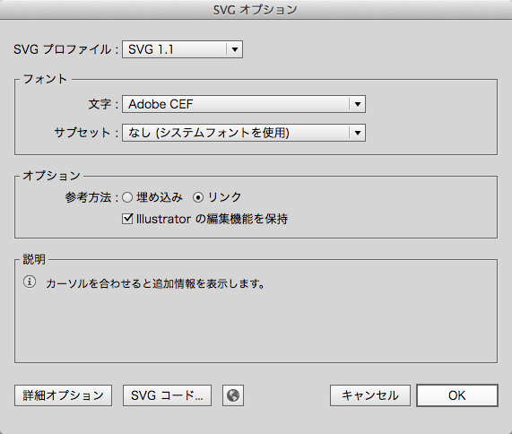
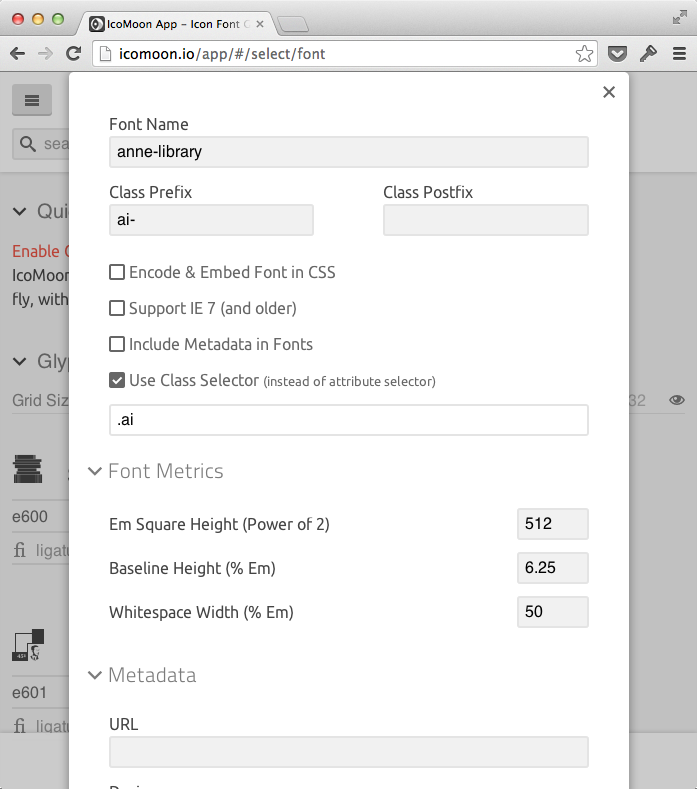

# Chapter 7: フォントの作り方 - Illustrator 編

この章では、なるべくデザイナーに馴染みのある環境で、シンボルフォントを作る方法をチュートリアル形式で、説明します。フォントの変換には、WebアプリケーションのIcoMoonを使いますが、下記の手順に沿って作業すれば、特に難しい部分はありません。

## 制作に使うもの

- Mac または Windows
- Adobe Illustrator (グリッド、ベジェ曲線を扱います)
- [IcoMoon](http://icomoon.io/) (Webアプリケーション)
- HTML / CSS の基礎知識
- [このテンプレート](https://github.com/AnneLibrary/annelibrary.github.io/tree/template)をダウンロード(or クローン)したもの

## 下準備

シンボルフォントを使った[サンプルサイト](http://annelibrary.github.io/)があります。こちらの制作途中という想定の[テンプレート](https://github.com/AnneLibrary/annelibrary.github.io/tree/template)を用意しましたので、[ダウンロード](https://github.com/AnneLibrary/annelibrary.github.io/archive/template.zip)または、[クローン](github-mac://openRepo/https://github.com/AnneLibrary/annelibrary.github.io)して、以下の手順を追って下さい。

- テンプレート: [https://github.com/AnneLibrary/annelibrary.github.io/tree/template](https://github.com/AnneLibrary/annelibrary.github.io/tree/template)
- サンプルサイト: [http://annelibrary.github.io/](http://annelibrary.github.io/)

## シンボルフォントを作る

### アイコンの作成

0. Illustratorのテンプレートファイル`icons/512x512.ait`を開きます。

	

0. アートボードのサイズが「512 × 512px」になっていることを確認します。

	

0. グリッド設定が「グリッド:32px」「分割数:2」になっていることを確認します。

	

0. アートボードが濃いグリッドで16分割されていることを確認します。

0. 黒色で、フランクフルト(角丸長方形)と棒(長方形)を描きます。「パスファインダ」パレットから「合体」します。

	

0. 橙色で、マスタード(波線)を描きます。一本の直線を引いて、「効果 > パスの変形 > ジグザグ」を使うと良いでしょう。

	

0. 「オブジェクト > 分割・拡張...」を選択、「オブジェクト > パス > パスのアウトライン」を選択。

0. 黒い図形と、橙色の図形を両方選択して「パスファインダ」パレットから「全面オブジェクトで型抜き」します。

	

グリッドに揃えると、縮小時にもキレイに見えますが、ここでは省略します。

### SVGファイルに保存

0. 「ファイル > 保存」メニューを選択します。

	

0. 保存場所として、`icons/`ディレクトリを指定します。保存形式は「SVG(svg)」を選びます。ファイル名は`eat.svg`として、「保存」ボタンをクリックします。

0. 「Illustratorの編集機能を保持」にチェックを入れておくと、後で変更したいときにも、グリッドが使えます。「OK」ボタンをクリックします。

	

### IcoMoonでWEBフォントに変換

0. [IcoMoon App](http://icomoon.io/app/)にアクセスします。もし、選択状態のアイコンがある場合は、選択を解除しておきます。

	

0. 「Import Icons」ボタンをクリックして、ファイル選択ダイアログで`icons/`ディレクトリ内のすべてのSVGファイル(`books.svg`から`stacked.svg`まで)を選択します。

	

0. 一覧に、オリジナルのアイコンが追加されたはずです。

	

0. 右肩のメニューボタンをクリックして、「Select All/None」をクリックし、オリジナルアイコンをすべて選択状態にします。画面下部の「Font」ボタンをクリックすます。

	

0. 「U+」「fi」のボタンが選択されていることを確認します。

	

0. 「Preferences」ボタンをクリックして、設定画面を開きます。「Font Name: anne-library」「Class Prefix: ai-」「Use Class Selector」にチェックしてフォームに「.ai」と入力します。右上の「×」ボタンで設定画面を閉じます。(「ai」は「Anne Icon」の意です)

	

0. 画面下部の「ダウンロード」ボタンをクリックして、Zipファイルをダウンロード・解凍します。フォントデータとCSSが含まれていることを確認してください。

	

## シンボルフォントを使う

### フォントとCSSを組み込む

0. IcoMoonからダウンロードしたフォントをfontsディレクトリへ。同じくダウンロードした`style.css`は`anne-library.css`にリネームしてから、cssディレクトリへ。

	

0. IcoMoonが生成したCSSは、同一ディレクトリにフォントのディレクトリがあることを想定しているので、`fonts/`をすべて`../fonts/`に置換します。

	

### HTMLの編集

編集の前に、とりあえずブラウザで表示させてみましょう。アイコンがないので、さみしい感じです...

HEADタグの中の`<!-- (A) ここにフォントのCSS -->`と書かれた箇所で、下記のようにCSSを読み込みます。

	<link href="css/anne-library.css" rel="stylesheet">

`<!-- (B) ここにアイコン:girl -->`と書かれた箇所で、下記のように記述します。

	<i class="ai ai-girl"></i>

他のアイコンも同様に、記述します。計12のアイコンがあります。

- girl
- read, borrow, buy, eat, diary, related
- stacked, books, leaned, pot, grinder

以上の編集が出来たら、保存してブラウザで確認してみましょう。

