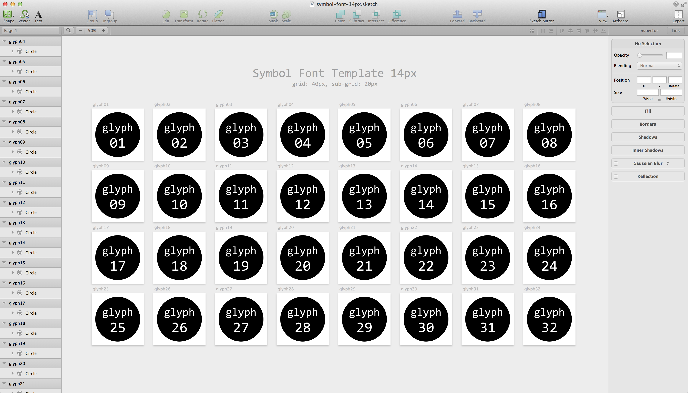
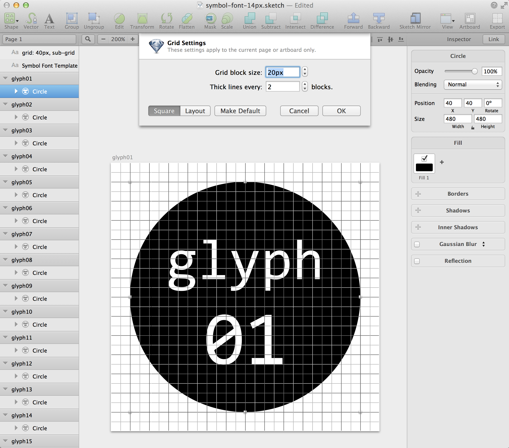

# Chapter 8: フォントの作り方 - Sketch 編

Glyphsはフォント制作の延長から、Illustratorは既存のアイコン制作の延長からのアプリ選定でした。どちらも非常に良いソフトなのですが、シンボルフォントに限って言えば、帯に短しタスキに長しな部分もあります。この章で紹介するSketchは、Illustrator/Fireworksなどの代替アプリケーションとして注目されています。ベクター画像の編集に特化していること、画像の切り出し機能が非常に優れていることが特徴です。

Sketchには、幸いPNGだけでなくSVGで画像を出力する機能が備わっています。そこで基本的な手順としては次のように作業を進めます。

- テンプレートファイルのダウンロード
- Sketchでグリフの作成
- SketchからSVS出力
- FontCustomで変換

制作にあたって便利なテンプレートファイルを、14px用と、16px用の2種用意しました。本章の説明は14px (FontAwesome互換) で進めますが、用途に合わせてどちらかを選んでください。

ダウンロードは、GitHubのプロジェクトページから可能です。

(TODO: GitHubのリンク先を掲載)

## グリッドの設定

作業の前に、Chapter 5の「グリッドの設計」を確認しておいてください。ここでは、Font Awesomeに合わせて、独自のグリフを作る想定で説明を進めます。フォントの基準のサイズを14pxとすると、4倍までの4パターンを想定して56px、座標の精度を確保するためにその10倍として、キャンバスサイズを560pxとしました。

- 14px (x1)
- 28px (x2)
- 42px (x3)
- 56px (x4)

Sketchでテンプレートファイルを開いて、`View > Grid Settings...`メニューを開くと、下記のように設定されているはずです。

- Grid block size: 20px
- Thick lines every: 2 blocks.

つまり、40pxごとにグリッド、その半分で補助グリッドが引かれます。Sketchでは

- 矢印キーによる入力: 1px
- Shift + 矢印キーによる入力: 10px

となるので、微調整はマウスだけでなくキー入力も併用して、グリッドに揃えていきましょう。

※注: この章の後半でフォントに変換する際、FontCustom(あるいはgrunt-webfont)を使うと、キャンバスサイズが512pxに縮小されてから処理されます。そのため望ましくはありませんが、14pxグリッドから若干ずれる可能性があります。(基準サイズを16pxとした場合は、512の約数なので問題ありません)

## グリフの作成

## SVG出力

## フォント変換

### Font Custom
