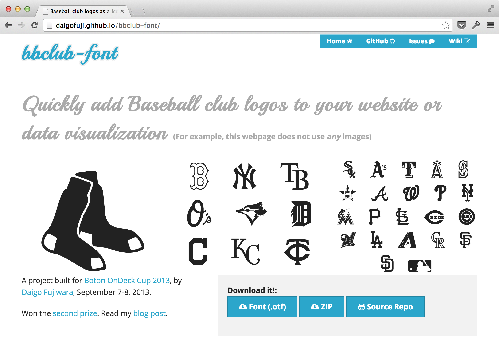

# Part 3: 極める

# Chapter 10: デザインのアイデア

## 立体感のあるアイコン

## 多諧調アイコン

仕掛けはシンプルで、諧調毎のグリフを作成して、CSSで重ね合わせます。原理的には何色でも重ねられますが、:beforeと:afterの疑似要素を使って2色で表現するのが簡便です。

(TODO: レイヤーフォントの概念図。多色と2色)

Stackiconsは60種あまりのソーシャルアイコン(FacebookやTwitterほか)を揃えた、オープンソースのシンボルフォントです。Stackiconsには2色以上のアイコンもありますが、その場合はspanタグを重ねることで対処しています。Stackiconsのサイトでも指摘しているように、HTMLをあまりキレイに書けないのが難点です。メンテナンス性を考えると2色に限定するか、JavaScriptを併用してHTMLをクリーンに保つのが適当かもしれません。

- Stackicons [http://stackicons.com/](http://stackicons.com/)

以下では、2色のアイコンを自作する方法を簡単に紹介します。

### 多色グリフの作成

Sketchを使います。Illustratorでもできなくはないですが、今回の用途には、出力するレイヤーをコントロールできるSketchの方が適しています。

(TODO: 作成手順)

### CSSの実装

:beforeに淡色、:afterに濃色を重ねます。このとき、淡色を色指定ではなく、透明度指定(opacity)にするのがポイントです。

	.mi {
		display: inline-block;
		font-family: MyIcons;
		font-style: normal;
		font-weight: normal;
		line-height: 1;
		-webkit-font-smoothing: antialiased;
		-moz-osx-font-smoothing: grayscale;
	}
	.mi:before { opacity:.5 }
	
	/* ひとつのアイコンとして使う場合 */
	.mi-cup:before { content:"\e001" }
	.mi-cup:after { content:"\e002" }
	.mi-glass:before { content:"\e003" }
	.mi-glass:after { content:"\e004" }
	
	/* 淡色、濃色を個別に使う場合 */
	.mi-cup-light:after { content:"\e001" }
	.mi-cup-dark:after { content:"\e002" }
	.mi-glass-light:after { content:"\e003" }
	.mi-glass-dark:after { content:"\e004" }

HTMLへの組み込みは次のようになります。前節で説明した、通常の組み込み方法と同じです。

	
	

(TODO: スクリーンショット)

## メジャーリーグ球団のロゴフォント

"bbclub font"はMLBの30チームのロゴを納めたフォントです。作者のDaigo Fujikawa氏の[ブログ記事](http://www.daigo.org/2013/09/introducing-bbclub-font-easily-add-baseball-club-logos-to-your-site-app/)によると、Glyphs miniを使って制作したとのことです。

- bbclub font [http://daigofuji.github.io/bbclub-font/](http://daigofuji.github.io/bbclub-font/)

こういった、特定のジャンルのロゴやシンボルを集めたフォントは今後需要が増えそうな分野です。bbclub fontは有志による作品ですが、ベストなのは権利団体が自ら公式フォントを配信するようになることかましれません。商標などの権利問題もクリアになって、より制作に使いやすくなると期待しています。

## アメリカの州フォント・都道府県フォント

### Stately

シンボルフォントの活用は、アイコンに限りません。ちょっと意外な使い方として、Statelyがあります。

これは、アメリカの各州をグリフに見立てて、フォントにしたものです。州の形と位置がフォントデータに含まれるため、全州のグリフを重ねるとアメリカ地図になります。特定の州だけ、スタイル指定で色を付ければ、上記の画像のようになります。

- [http://intridea.github.io/stately/](http://intridea.github.io/stately/)

### Prefectly

Statelyにインスパイアされて、作られた日本版が、Prefectlyです。こちらは、各県のデータがフォントに含まれています。これを使えば日本地図を描くのも簡単です。

- [http://deform.jp/prefectly/](http://deform.jp/prefectly/)

## カラーフォント

シンボルフォントの美点であり弱点なのは、表現が1色なことでした。フラットデザイン一辺倒な現在は良いとして、今後のデザイントレンドに対応できるのでしょうか? この疑問へのひとつの回答は、前述のようなCSS表現や多諧調アイコンです。もうひとつが、WOFFで仕様に盛り込まれ、Windows 8.1 で対応したカラーフォントです。Windows 8.1 には、Segoe UI Symbol font (以下Segoe) が含まれており、Windowsアプリケーションから利用できるだけでなく、Internet Explorer 11以降のブラウザ上でも表示が可能です。

(TODO: Segoeのスクリーンショット)

Appleは、iOSでOpenTypeにPNGファイルを埋め込む形で絵文字に対応しましたが、Segoeは完全なベクターフォントです。特徴をいくつか挙げると、

- ベクターデータで容量が軽い
- フォールバックとして単色フォントを含む
- 各色ごとのグリフを持ち、レイヤーの重ね合わせとして多色刷りを実現

など、魅力的です。Microsoftは現在、この方式をOpenTypeで標準化すべく働きかけています。

- Segoe UI Symbol icons [http://msdn.microsoft.com/en-us/library/windows/apps/jj841126.aspx](http://msdn.microsoft.com/en-us/library/windows/apps/jj841126.aspx)

また、同様の取り組みは、SVG陣営からも提案されています。仕様の副題に「リッチな画像表現をフォントへ」と書かれているように、カラーパレットを定義する仕組みが盛り込まれているなど、こちらも意欲的です。

> The SVG glyph descriptions may contain color variables whose values are obtained either from one of the various color palettes in the Color Palette (CPAL) table or by other means, for example values specified by the user.

- SVG Glyphs in OpenType Specification [http://www.w3.org/2013/10/SVG_in_OpenType/](http://www.w3.org/2013/10/SVG_in_OpenType/)

カラーフォントが、Webで一般に使えるようになるには、しばらく時間かかるかもしれません。ですが、Windows 8.1 や、W3Cの動きからも、今後もアイコンをフォントで表現するのは既定路線と考えて良さそうです。

