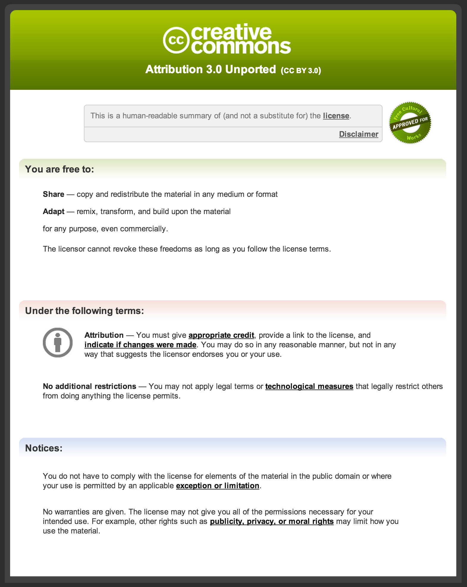

# Chapter 12: フォントのライセンス

全部のアイコンをオリジナルで作成する場合は、ライセンスを気にする必要はあまりないかもしれません。ただ、実際の制作では、すべてのアイコンを一から作ることは時間的にも困難です。選択肢として、

- A: 商用のシンボルフォントを使う
- B: オープンソースのシンボルフォントを使う
- C: ロイヤリティフリーの商用シンボルフォントを改変して使う
- D: オリジナルのシンボルフォントを作成する

の4つのケースが考えられますが、(金額はともかく)上から順に自由度が高くなります。Aの例としては、一般のWebフォントサービスのほとんどや、[Symbolset](https://symbolset.com/)がこれにあたります。[Glyphicon](http://glyphicons.com/)は、提供しているSVGファイルをWebフォントに組み込むことを許しているので、Cのケースにあたります。

問題になるのは、商用フォントと、オープンソースフォントのライセンスの整合性です。商用フォントはロイヤリティフリーでない限り、改変は基本的にできません。そのため、フォントは提供されたそのままで使うことになります。下記、シンボルフォントを組み合わせて新たなフォントにできるかどうか、表にまとめます。

| タイプ            | A: 商用 | B: OSS | C: RF | D: 独自 |
| ---------------------------- | :-: | :-: | :-: | :-: |
| A: 商用フォント                |     |     |     |     |
| B: オープンソースフォント        |     |  ☆  |     |  ☆  |
| C: 商用ロイヤリティフリーフォント |     |     |  ★  |  ★  |
| D: 独自フォント                |     |  ☆  |  ★  |  ★  |

オープンソースのフォントを組み合わせる場合、ライセンスが異なるとNGの可能性もあります。オープンソース同士、あるいは独自フォントと組み合わせた場合、派生物にも同一のオープンソースライセンスをつけなくてはなりません。商用サイトを作成する場合、この制約が現実的でないことも多いでしょう。混ぜ合わせるのは、CとD(ロイヤリティフリーと独自フォント)だけにして、それ以外はそのまま別ファイルとして使うほかありません。つまり、

- オープンソースフォント
- ロイヤリティフリーフォント / 独自フォント

あるいは、

- 商用フォント
- ロイヤリティフリーフォント / 独自フォント

の2ファイル(または3つ以上)を読み込むことになるでしょう。フォント数が増えることは、リクエスト数が増えてしまう点ではマイナスですが、メンテナンス性を考えると悪いことばかりではありません。オープンソース/商用フォントの部分だけ独立させておくことで、バージョンアップがやりやすいのは良い点です。

## 商用ライセンスの例

商用フォントのライセンスは、それぞれ独自のものになっています。例えば、[Symbolsetのライセンスページ](https://symbolset.com/license)が分かりやすいので見てみましょう。そのまま抜粋します。

- **You can**: Use on unlimited sites, Backup, Embed, Print
- **Plz don’t**: Distribute, Subset, Modify, Copy

つまり...

- **やっていいこと**: 複数サイトで使う、バックアップ、埋め込み、印刷
- **しないでください**: 再配布、サブセットの作成、変更、コピー

ということです。利用するグリフだけ抜き出したフォントのサブセットを作ることは許されていません。部分的にグリフを調整したり追加するのもNGです。必要なアイコンがすべて含まれていれば構いませんが、なかなかそうも行きません。少々、制約が厳しいようにも感じます。ただ、1ユーザが複数サイトに使ってよいという点は太っ腹です。

続いて、Glyphiconも見てみましょう。先ほどよりは少し長いですが、[ライセンスページ](http://glyphicons.com/license/)を引用します。

- **You can**:
	- use icons in your HTML theme and sell it (you are obliged to include this license)
	- use icons in your mobile or web app, web, print them etc.
	- modify icons and change their color, shape, etc.
- **You must not**:
	- use icons in your HTML theme and sell it without including this license
	-resell icons or offer them for download anywhere on the internet
	- use icons as a part of any application where your customers are not a final customer

特徴的なのは、"modify icons"が許可されている点です。Glyphiconはロイヤリティフリーのアイコンセットなので、この点が明記されている訳です。

シンボルフォントではなく、一般的なWebフォントの提供元であるTypeKitのライセンスも参考まで、URLを掲載しておきます。ざっと目を通すと分かりますが、こと細かくフォントの使用条件が規定されていて、ユーザからすると窮屈な印象は拭えません。フォントの権利は歴史的にも強く守られて来た背景があり、DTPでの慣習が色濃く残っている分野です。その意味では、Glyphiconのロイヤリティフリーのライセンスがむしろ異質で、「フォント」というよりはストックフォト文化の延長に位置しています。

- [http://help.typekit.com/customer/ja/portal/articles/1341590](http://help.typekit.com/customer/ja/portal/articles/1341590)
- [http://www.adobe.com/products/eulas/tou_edgewebfonts/](http://www.adobe.com/products/eulas/tou_edgewebfonts/)

## オープンなライセンスの選択肢

現在、多くのオープンなフォントが公開されていますが、それらを集約している"Open Font Library"というサイトがあります。

- Open Font Library [http://openfontlibrary.org/](http://openfontlibrary.org/)

ここに、採用ライセンスについての統計が載っていますので、上位4つを抜き出すと...

- SIL Open Font License (209)
- GNU General Public License (86)
- Creative Commons (24)
- MIT License (19)

という状況のようです。もちろん、すべての公開フォントが掲載されてるいる訳ではないので、参考値ですが、OFLの採用例が多いのは間違いなさそうです。GPLについては、プログラムのソースコードがGPLだから、という理由で採用例が多くなっています。次節以降、この中でフォント向きと考えられる、OFL、CCについて見ていきましょう。

## SIL Open Font License

オープンフォントライセンス(OFL)は、オープンソースのフォントライセンスとして人気の高いライセンスです。

- 共同作業によるフォントプロジェクトの世界規模での発展を促進
- コミュニティのフォント作成の活動をサポート
- フォントの共有や改良が可能な自由でオープンなフレームワーク提供

を目的としています。ライセンスが付与されたフォントは、使用、研究、改変、再配布をユーザが自由に行うことができますが、それ自体の販売することは認められません。他のソフトウェアとのバンドルや埋め込みも可能ですが、GPLと同様に派生物を別ライセンスに変更することは出来ません。

例えばFontAwesomeはOFLでライセンスされているので、

- FontAwesomeを有料販売することはできない
- 利用するにあたり、著作権表示とOFLを含めなければならない
- 独自のグリフを追加して使う場合、改変フォントもOFLにしなければならない

といったことを守らなくてはなりません。

現在の最新版は 1.1 (2007-02-26 発行) で、日本語訳がOSG-JP(Open Source Group Japan)にあります。

- Version 1.1 原文: [http://scripts.sil.org/OFL](http://scripts.sil.org/OFL)
- Version 1.1 日本語訳: [http://sourceforge.jp/projects/opensource/wiki/SIL_Open_Font_License_1.1](http://sourceforge.jp/projects/opensource/wiki/SIL_Open_Font_License_1.1)

### GPLとの互換性について

- [http://en.wikipedia.org/wiki/GPL_font_exception](http://en.wikipedia.org/wiki/GPL_font_exception)
- [http://www.gnu.org/licenses/gpl-faq.html#FontException](http://www.gnu.org/licenses/gpl-faq.html#FontException)

### 予約フォント名 (Reserved Font Names)

オリジナルのフォントであれば、フォント名は基本的には自由に付けられますが、MacやWindowsに標準インストールされているフォント、有名なフォントとは重複を避けるべきです。また、OFLは「予約フォント名(RFNs=Reserved Font Names)」という仕組みをライセンスの中で提供して、フォント名の衝突を避けるよう呼びかけています。

例えば、Google Fontsで配信されている「Aladin」フォントには、ライセンス属性として、

	Aladin-Regular.ttf: Copyright (c) 2009 Angel Koziupa (sudtipos@sudtipos.com), Copyright (c) 2009 Alejandro Paul (sudtipos@sudtipos.com), with Reserved Font Name "Aladin"

と[掲載](https://www.google.com/fonts/attribution)されています。この表記の「with Reserved Font Name "Aladin"」の箇所が重要で、"Aladin"を予約フォント名としていることが分かります。OFLでは、派生物に予約フォント名をつけることができません。つまり、Aladinフォントの一部を改変して公開する場合、フォント名にAladinを使うことはライセンス違反となります。

- × 同じフォント名「Aladin」を付ける
- ○ まったく別の名前「Genie」を付ける
- △ 名前の一部分を使う「Betterdin」

なお、最後の例を△としたのは、ライセンス違反ではないものの、OFLのドキュメントで推奨しないと書かれているためです。元のフォントとの関連性や敬意を示したければ、接頭辞や接尾辞ではなく、メタデータ(あるいはFONTLOG)に書くべきとのことです。

- Web Fonts and Reserved Font Names [http://scripts.sil.org/cms/scripts/page.php?item_id=OFL_web_fonts_and_RFNs](http://scripts.sil.org/cms/scripts/page.php?item_id=OFL_web_fonts_and_RFNs)

## Creative Commons

Createive Commons(CC)は、いわばコンテンツのオープンソースとして人気です。シンボルフォントのライセンスとして使われるケースもあります。

TODO: 詳細を書く

## 混ぜるな危険?

## ロゴのライセンス

シンボルフォントに企業のロゴを含める場合、オープンなライセンスと相容れないことがあります。その場合は、再配布を許可しないようにオープンライセンスではなく、独自のライセンスとするべきです。ただし、サポーターロゴのように、ある程度自由にユーザに利用を促したい場合は、別の手段を講じる必要があります。以下、その二つのケースについて検討します。

### 再配布不可の企業ロゴを使う場合

### ユーザに利用を促したい場合

http://creativecommons.org/licenses/by-nc-nd/4.0/deed.ja

## 文字を含むグリフの扱い

