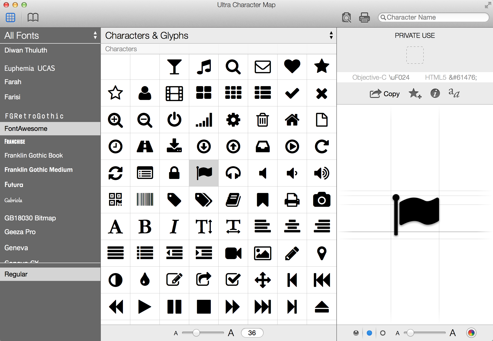
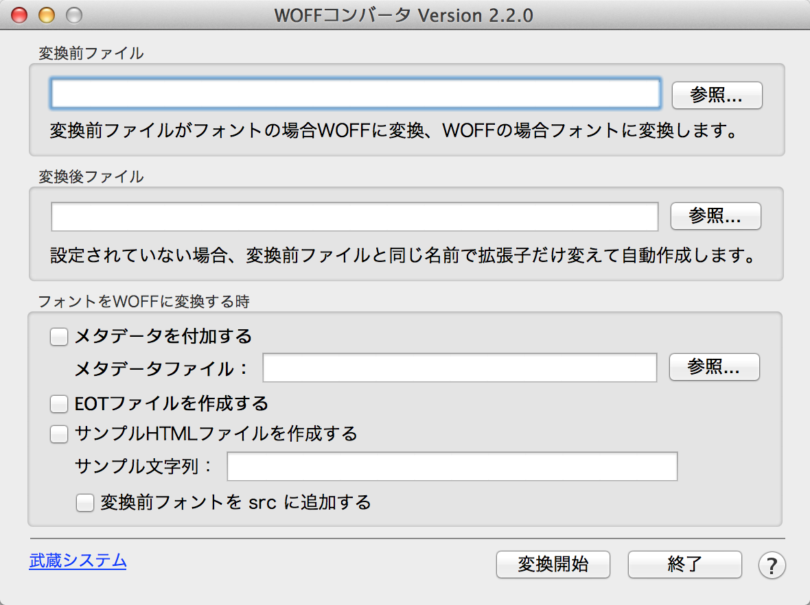

# APPENDIX

## A: アプリケーション一覧

### Adobe Illustrator (Mac & Win)

SVGファイルを直接編集できる事実上唯一のアプリケーション。
単品購入は前バージョンCS6ののみ可能で¥75,000、Creative Cloudの場合は単体でも月あたり¥2,200と高額ですが、すでにユーザであれば、Illustratorが第一の選択肢となるでしょう。「Chapter 7: フォントの作り方・Illustrator編」を参照。

- [http://www.adobe.com/products/illustrator.html](http://www.adobe.com/products/illustrator.html)

### FontPrep (Mac)

TrueTypeフォントを指定すると、自動的にWOFF/EOT/SVGに変換し、組み込みに必要なCSSを生成してくれるアプリケーション。Glyphsとの組み合わせで使います。

- [http://fontprep.com/](http://fontprep.com/)

### Glyphs / Glyphs mini (Mac)

本格的なフォント作成ツール。シンボルフォントを作るだけだと、少々オーバースペックですが、非常に使いやすいです。TrueType、OpenTypeのフォントを直接開くことが可能で、OpenTypeフォントの出力に対応します。Illustratorからコピー&ペーストで曲線データを貼付けることも可能ですが、単体でフォントデザインに十分な編集能力を持ちます。

Glyphs miniはApp Storeで¥4,500程度と、一般的なフォントアプリケーションに比べて非常に安価なので、シンボルフォントのためだけに購入するとすれば、フォント制作のアプリケーションとしては唯一の選択肢になるでしょう。「Chapter 6: フォントの作り方・Glyphs編」を参照。

- [http://www.glyphsapp.com/](http://www.glyphsapp.com/)
- [http://www.glyphsapp.com/glyphs-mini](http://www.glyphsapp.com/glyphs-mini)

### Sketch (Mac)

Webに特化したベクター画像の編集ツール。IllustratorやFireworksの代替アプリケーションとして注目が集まっています。SVGの出力が可能です。「Chapter 8: フォントの作り方・Sketch編」を参照。

- [http://www.bohemiancoding.com/sketch/](http://www.bohemiancoding.com/sketch/)

### Ultra Character Map (Mac)

フォントに含まれるグリフの一覧が見られるアプリケーション。

- グリフを文字としてコピー
- グリフをアウトラインとしてコピー

の両方ができるため、様々な場面で重宝します。文字コードを確認することも可。

- [http://www.x04studios.com/ultracharactermap.html](http://www.x04studios.com/ultracharactermap.html)

### WOFFコンバータ (Mac & Win)

下記の変換が可能な無償ソフトウェア。

- TrueType → WOFF + EOT (EOTはオプション)
- OpenType → WOFF + EOT (EOTはオプション)
- WOFF → TrueType
- WOFF → OpenType

WOFFからも変換できるのは、他のアプリにない特徴。

- [http://opentype.jp/woffconv.htm](http://opentype.jp/woffconv.htm)

